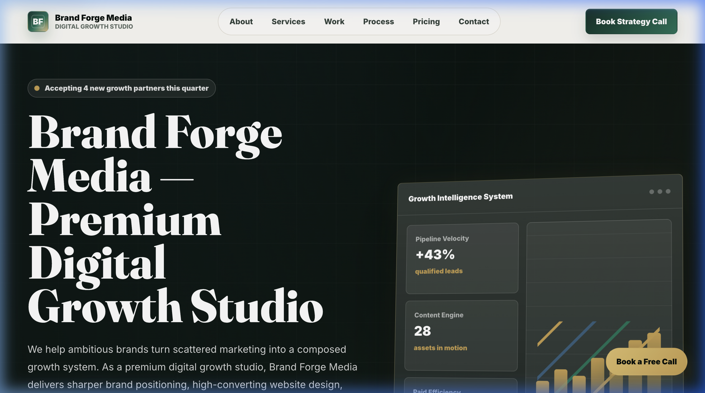
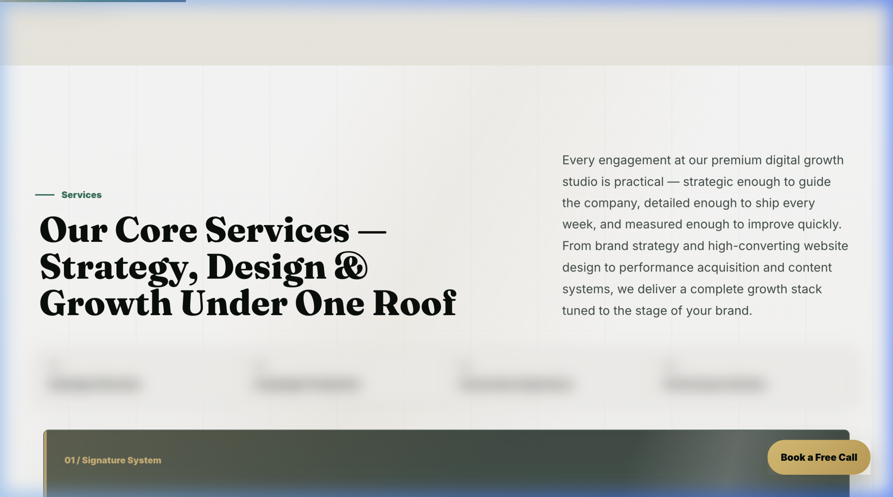
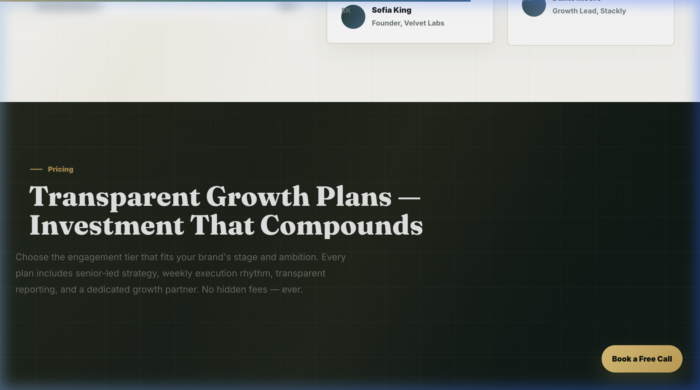

<div align="center">

# 🔥 Brand Forge Media

### Premium Digital Growth Studio

**Strategy · Design · Acquisition · Conversion**

[](https://saawant07.github.io/bfm/)
[](https://github.com/saawant07/bfm)
[](LICENSE)
[](https://saawant07.github.io/bfm/)

---

*A high-performance, SEO-optimized single-page website for a premium digital growth studio specializing in brand strategy, high-converting website design, content systems, and performance marketing.*

</div>

---

## 📸 Preview

<div align="center">

### Hero Section


### Services & Pricing




</div>

---

## ✨ Features

| Category | Details |
|---|---|
| 🎨 **Premium Design** | Hand-crafted editorial aesthetic with deep navy-black base, champagne gold accents, and Fraunces serif typography |
| ⚡ **Performance** | Single-file architecture, zero framework overhead, optimized for Core Web Vitals |
| 🔍 **SEO-Ready** | Complete meta tags, Open Graph, Twitter Cards, JSON-LD schemas (Organization, WebSite, Service, FAQ, Breadcrumb), semantic heading hierarchy |
| 📱 **Fully Responsive** | Mobile-first design with fluid typography, adaptive layouts, and touch-optimized interactions |
| 🎬 **Rich Animations** | Scroll-triggered reveal system, parallax effects, micro-interactions, and editorial motion design — all CSS-driven |
| 💰 **Razorpay-Ready** | 5-tier INR pricing with `data-razorpay` attributes pre-wired for payment integration |
| ♿ **Accessible** | Skip links, ARIA labels, focus-visible outlines, semantic HTML, reduced motion support |
| 🌐 **PWA Support** | Web manifest, theme colors, Apple touch icons, and standalone display mode |

---

## 🛠️ Tech Stack

| Layer | Technology |
|---|---|
| **Structure** | HTML5 (semantic, single-page) |
| **Styling** | Vanilla CSS (custom properties, Grid, Flexbox, animations) |
| **Typography** | [Inter](https://fonts.google.com/specimen/Inter) + [Fraunces](https://fonts.google.com/specimen/Fraunces) via Google Fonts |
| **Build Tool** | [Vite](https://vite.dev/) — lightning-fast HMR and optimized production builds |
| **SEO** | JSON-LD structured data, Open Graph, Twitter Cards, sitemap.xml, robots.txt |
| **Deployment** | GitHub Pages / Any static host |

---

## 📦 Project Structure

```
bfm/
├── index.html          # Complete single-page application (HTML + CSS + JS)
├── robots.txt          # Search engine crawler directives
├── sitemap.xml         # XML sitemap for SEO
├── site.webmanifest    # PWA web app manifest
├── package.json        # Vite dev server configuration
├── vite.config.mjs     # Vite build configuration
├── docs/               # Screenshots and documentation assets
│   ├── hero-preview.png
│   ├── services-preview.png
│   └── pricing-preview.png
└── README.md
```

---

## 🚀 Getting Started

### Prerequisites

- [Node.js](https://nodejs.org/) v18+
- npm or yarn

### Installation

```bash
# Clone the repository
git clone https://github.com/saawant07/bfm.git
cd bfm

# Install dependencies
npm install

# Start development server
npm run dev
```

The site will be available at **http://localhost:5173/**

### Production Build

```bash
# Build for production
npm run build

# Preview production build
npm run preview
```

---

## 🔍 SEO Architecture

This project implements a comprehensive SEO strategy for maximum search visibility:

- **Title Tag:** `Brand Forge Media | Premium Digital Growth Studio` (under 60 chars)
- **Meta Description:** Keyword-rich, 158 characters
- **Canonical URL** for duplicate content prevention
- **Open Graph** tags with image dimensions and locale
- **Twitter Cards** with `summary_large_image`
- **5 JSON-LD Schemas:** Organization, WebSite, Service (4 services), FAQPage (8 questions), BreadcrumbList
- **Semantic Headings:** Single H1 → keyword-optimized H2s → contextual H3s
- **robots.txt** + **sitemap.xml** for crawler guidance

### Target Keywords

| Priority | Keyword |
|---|---|
| Primary | premium digital growth studio |
| Secondary | brand strategy agency india |
| Secondary | high converting website design |
| Secondary | digital marketing studio |
| Secondary | UI/UX design agency |

---

## 💳 Pricing Tiers (INR)

| Plan | Monthly | Annual (20% off) | Target |
|---|---|---|---|
| **Starter** | ₹14,999 | ₹11,999 | Early-stage brands |
| **Growth** | ₹29,999 | ₹23,999 | Ambitious scaling brands |
| **Premium** ⭐ | ₹49,999 | ₹39,999 | Full-stack growth (Most Chosen) |
| **Scale** | ₹79,999 | ₹63,999 | Multi-channel acquisition |
| **Enterprise** | Custom | Custom | Complex enterprise needs |

All CTAs are pre-wired with `data-razorpay-plan` and `data-razorpay-amount` attributes for seamless Razorpay Checkout integration.

---

## 🗺️ Roadmap

- [ ] Razorpay payment integration
- [ ] Blog / content hub pages
- [ ] Client dashboard portal
- [ ] Case study detail pages
- [ ] Multi-language support (Hindi)
- [ ] Custom domain setup
- [ ] Google Analytics 4 + Search Console
- [ ] OG image asset creation (1200×630)

---

## 📄 License

This project is proprietary. All rights reserved by **Brand Forge Media**.

---

<div align="center">

**Built with precision by [Brand Forge Media](https://saawant07.github.io/bfm/) 🇮🇳**

*Premium digital growth studio — brand strategy, high-converting website design, content systems & performance marketing for ambitious brands.*

</div>
